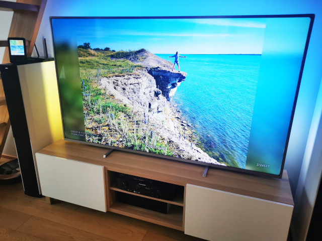

Cast photos from NAS directly to TV in 4K/UHD
=============================================

Cast photos & videos stored on a NAS directly to Google Chromecast or Android TV.

This is like having a huge photo frame in the house - images are shown in random order by default.
A good way to break your photo collection free.

## Required hardware

- *Synology NAS* device (or any other server containing photos and running PHP)
- *Google Chromecast* dongle for your TV or *Android TV device*

## Components

* sender/ - *Chromecast sender*, use it to start and control the show from Google Chrome, Chromium, Brave or other derived browser
* receiver/ - *Chromecast receiver* - this file will run on Chromecast dongle, or use it stand-alone for in-browser slideshow
* backend/ - PHP scripts for listing and serving the actual photos & videos from NAS, or any other php-enabled server
* config.php/js - each directory has a config file, where you can define paths of photos on your server and other options

## 4K/UHD TVs and Chromecast Ultra

Android TVs and Chromecast Ultra still cannot display any non-video content above FullHD 1080p.
2160p resolution is only used for compatible videos, any other elements of receiver are downscaled, including images.

In order to display images at full TV resolution, they are converted to 1-frame mp4 videos using `ffmpeg`, see [photov.php](backend/photov.php).
Set `mode: 'img'` in [receiver/config](receiver/config.js) if you are fine with 1080p resolution or cannot use `ffmpeg`.

## Installing on Synology NAS

- Enable *Web Station* in DSM web interface
- In PHP settings (in a tab), add your photos and videos directories to PHP open_basedir - otherwise they won't be accessible to PHP
- Copy/clone this repository to the *'web'* directory on your NAS
- Open **http://your-nas-ip/sender/** in your browser, start casting!
- Or open **http://your-nas-ip/receiver/** to watch photos in the browser (Use Esc key to specify the directory to watch)
- Optionally, enable DynamicDNS/Quick Connect, and request Let's Encrypt *https* certificate to have your URL as **https://your-nas.synology.me/**

Note: backend PHP scripts can take advantage of [rawfs](http://github.com/angryziber/rawfs) running on the NAS making it
possible to cast raw (e.g. Canon CR2) photos directly, without converting them to jpeg first. This is optional if your photos are already
in jpeg format.

Videos are streamed directly without transcoding, so your Chromecast must support their format. H264 works the best across devices.
Newer TVs and Chromecast Ultra do support VP9 and HEVC/H265 as well.

There is also an [Android sender app](https://github.com/angryziber/synology-cast-photos-android) for controlling the casted photos instead of *html sender*.

### Older Synology devices

If you own an older Synology with simple CPU that cannot resize/convert photos, set mode to 'img'.

E.g. on DS212j resizing a photo from Canon 5D mk2 takes about a minute with imagemagick, while Chromecast downloads 2.5Mb
over local Wi-Fi and fits the same image to the screen in just a couple of seconds.

Note, in the Releases there is an ARMv5 binary of ffmpeg that supports H264 encoding. It's slow, but works.

### Registering your own Chromecast appId (optional)

Chromecast receivers need to be registered with Google to get an *appId*.
I have already registered one that anyone can use, specified in [sender config](sender/config.js) -
it will load the receiver hosted on Github first, and then the sender will tell it to redirect to your own NAS (same origin that you use to access the sender).

If you want, you can also [register your own Chromecast receiver app](https://cast.google.com/publish/) with Google pointing to **http://your-nas-ip/receiver/**
You will need to pay Google $5 for the privilege, but it will also be possible to register your Chromecast device for testing,
enabling remote debugging/inspection and use of http (insecure) links.
